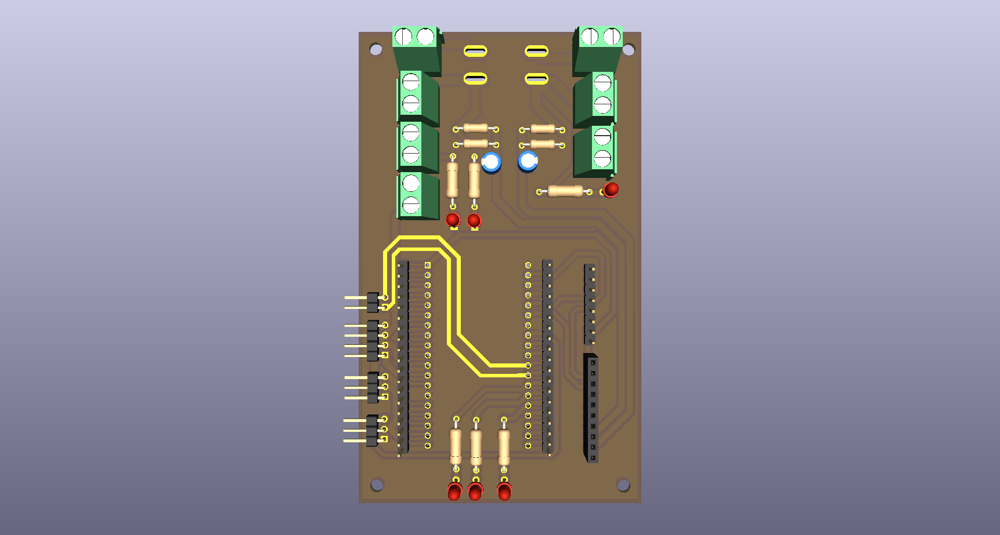

# 🏎️ Robocar Jr — Placa de Controle & Gerenciamento
### Robocar Race 2025 · hardware em KiCad 10

> Corpo de prova eletrônico de um carro autônomo de competição, projetado no **KiCad** para
> concentrar, em uma única placa, o cérebro (**ESP32‑DEVKITC**), o copiloto embarcado
> (**Raspberry Pi**), os sensores de navegação (**GY‑87**), a medição de energia (**ADS1115**)
> e toda a interface de potência dos atuadores (servo de direção + ESC/motor BLDC).

  
  
  
  
  
  

---

## ✨ O que a placa faz

| Bloco | Papel no veículo |
|-------|------------------|
| 🧠 **ESP32‑DEVKITC** | Controlador em tempo real (sensores, PWM, decisão), montado em soquete. |
| 🍓 **Raspberry Pi** | Co‑processador de visão/navegação, ligado ao ESP32 por **UART** e alimentado via **USB‑C** na placa. |
| 🧭 **GY‑87 (IMU)** | Orientação e movimento — MPU6050 + HMC5883L + BMP280, em barramento I²C. |
| 📊 **ADS1115** | ADC externo de **16 bits** (I²C) com **4 canais** para medição precisa de bateria e dos rails de potência. |
| ⚡ **Gestão de energia** | Conversor **Buck** (+5 V) e conversor **Step‑up** (+8 V / +12 V) a partir da bateria, com chaves de comutação. |
| 🎯 **Atuadores** | Saída dedicada para **servo** (direção, 5 V) e para **ESC/motor BLDC** (tração, 12 V de potência + sinal 5 V). |
| 💡 **Feedback visual** | LEDs de estado (**Estado_1/2/3**) e LEDs de presença de tensão (**+BV**, **+12 V**). |
| 📡 **Enlace serial** | UART `TX/RX_RASPBERRY` para telemetria e troca de comandos ESP32 ↔ Raspberry. |
| 🎮 **Modo manual (opcional)** | Previsão de entradas de receptor RC (`Radio`, `Servo Rec`, `Motor Rec`). |

---

## ⚡ Arquitetura de potência

A bateria (`+BV`) é a fonte primária e é distribuída/comutada por **chaves DPST (SW1/SW2)**.
Dois estágios de conversão DC‑DC geram os rails usados pelo sistema:

| Rail | Gerado por | Alimenta |
|------|-----------|----------|
| **+5 V** (`Buck_out`) | Conversor **Buck** (`Buck_in` → `Buck_out`) | Lógica de sinal, **servo motor**, barramento do enlace |
| **+3,3 V** | Regulação a partir de +5 V | **ESP32**, **GY‑87**, **ADS1115** |
| **+8 V** | Estágio de conversão | Nó de referência / medição |
| **+12 V** | Conversor **Step‑up** (`Step_up`) | **Potência do motor BLDC** via ESC (`Motor in`) |
| **USB‑C 5 V** | Conector `Raspbery_usbc` | **Raspberry Pi** |

> O **servo** recebe potência e sinal em 5 V (conector `J3`); o **motor/ESC** recebe a
> potência de 12 V pelo conector `Motor in` (`J11`) e o sinal PWM de 5 V pelo conector `J4` —
> separando claramente o caminho de potência do caminho de controle.

---

## 📊 Monitoramento de bateria e de rails (ADS1115)

Quatro entradas analógicas, todas condicionadas por **divisores resistivos + filtro RC**,
lidas com resolução de 16 bits (muito mais estáveis que o ADC interno do ESP32):

| Canal | Origem medida | Sentido |
|:-----:|---------------|---------|
| **A0** | Bateria **3S** | Tensão do pack principal |
| **A1** | Bateria **2S** / ESC | Tensão do pack auxiliar |
| **A2** | Rail **+12 V** | Validação do Step‑up / potência do motor |
| **A3** | Rail **+8 V** | Validação do estágio intermediário |

Endereço I²C do ADS1115 com `ADDR` amarrado ao GND (**0x48**); `ALERT` usado conforme estratégia de firmware (polling ou interrupção).

---

## 🔗 Comunicação & interfaces

- **I²C (compartilhado):** `SDA` e `SCL` ligam **GY‑87** e **ADS1115** ao ESP32.
- **UART ↔ Raspberry:** pares `TX_RASPBERRY` / `RX_RASPBERRY` formam o enlace serial
  ESP32 ⇄ Raspberry (telemetria, comandos, handshake de missão).
- **Sinais de controle:** `Sinal_Servo` (direção) e `Sinal_Motor` (tração via ESC).
- **Feedback luminoso:** `Estado_1`, `Estado_2`, `Estado_3` (LEDs 3 mm, R = 220 Ω) indicam a
  fase/estado da máquina; LEDs adicionais sinalizam presença de **+BV** (R = 330 Ω) e **+12 V** (R = 1 kΩ).
- **Chaves:** `SW1`/`SW2` (DPST) para comutação/corte dos ramos de bateria e enlace.

---

## 🧱 Conectores de campo

| Ref. | Função | Sinais |
|------|--------|--------|
| **J7** | Módulo **GY‑87** | +3,3 V · SCL · SDA · GND |
| **J10** | Entrada do **Buck** | `Buck_in` · GND |
| **J11** | Potência do **motor** | +12 V (`Motor in`) · GND |
| **J3** | **Servo motor** | +5 V (`Buck_out`) · `Sinal_Servo` · GND |
| **J4** | Sinal do **ESC/motor** | +5 V · `Sinal_Motor` · GND |
| **J14** | **USB‑C do Raspberry** | +5 V · GND |
| **J15** | Saída do **Step‑up** | +12 V · GND |
| **J2 / J5** | Soquete / breakout **ESP32‑DEVKITC** | barramento completo do módulo |
| **SW1 / SW2** | Chaves DPST | comutação de bateria/enlace |

> A atribuição física de cada GPIO do ESP32 segue o soquete `J2`/`J5`; a referência canônica
> é o esquemático hierárquico incluído no projeto.

---

## 🖼️ Galeria

### Esquemático (hierárquico)
Blocos de baterias, entradas de motor/conversor Buck, barramento do Raspberry, conexões do
GY‑87, enlace serial, ADS1115, divisores de tensão e LEDs de feedback.

### Layout da PCB
Posicionamento dos conectores de bateria e de potência, soquete do ESP32, trilhas de 12 V /
5 V dimensionadas para corrente e separação cuidadosa entre potência e sinal.

---

## 📄 Licença & crédito

Hardware aberto sob licença **MIT** — use, estude e adapte como base para o seu Robocar Jr. 🏁

Projeto de competição · **Robocar Race 2025** · desenvolvido por **Pablo Nunes de Oliveira** · KiCad E.D.A. 10
